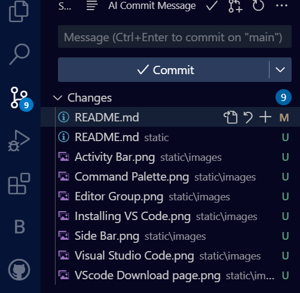

# SE-Assignment-5
Installation and Navigation of Visual Studio Code (VS Code)
 Instructions:
Answer the following questions based on your understanding of the installation and navigation of Visual Studio Code (VS Code). Provide detailed explanations and examples where appropriate.

 Questions:

## 1. Installation of VS Code:
   - Describe the steps to download and install Visual Studio Code on Windows 11 operating system. Include any prerequisites that might be needed.

   #### Prerequisites for Installing VS Code on Windows 11
   - Windows 11 Operating System

   - Ensure that the system meets the minimum system requirements for VS Code, which includes a 64 bit version of Windows 11, 2 GB of RAM, and 300 MB of available disk space.

   - Ensure that the system has a stable internet connection for downloading the VS Code installer.

   - Ensure that the system has administrative privileges to install software.

   #### Steps to Download and Install VS Code on Windows 11

   Step 1:Open a web browser, Microsoft Edge , and navigate to the official VS Code download page ([https://code.visualstudio.com/download](https://code.visualstudio.com/download))

   

   Step 2: Click on the "Download" button for the Windows platform to start the download of the Visual Studio Code Application.

   Step 3: When the download finishes, then the Visual Studio Code Icon appears in the downloads folder. 

   Step 4: Run the VS Code installer (VSCodeSetup-x64.exe for 64-bit systems) by double-clicking on it to start the installation process of the Visual Studio Code.

   Step 5: After the Installer opens, it will ask you to accept the terms and conditions of the Visual Studio Code. Click on I accept the agreement and then click the Next button.

   Step 6: Choose the location data for running the Visual Studio Code. It will then ask you to browse the location. Then click on the Next button.

   Step 7: Then it will ask to begin the installation setup. Click on the Install button.

   Step 8: After clicking on Install, it will take about 1 minute to install the Visual Studio Code on your device.

   

   STEP 9: After the Installation setup for Visual Studio Code is finished tick the “Launch Visual Studio Code” checkbox and then click Next.
   
   STEP 10: After the previous step, the Visual Studio Code window opens successfully. 

   

## 2. First-time Setup:
   - After installing VS Code, what initial configurations and settings should be adjusted for an optimal coding environment? Mention any important settings or extensions.

   (a) Updating of VS Code by going to `Help` > `Check for Updates`

   (b) Theme and Appearance: Customizing the look of the editor by going to `File` > `Preferences` > `Color Theme` and choose a theme that suits your preference.

   (c) Font and Font Size: Adjusting the font size and typeface for better readability by going to `File` > `Preferences` > `Settings`, then search for Font Family and Font Size to customize your editor's text appearance.
   
   (d) Configure Auto-Save: (MOST IMPORTANT) Enable auto-saving of files to avoid losing changes by going to `File` > `Preferences` > `Settings`, search for Auto Save, and set it to afterDelay or onWindowChange.

   (e) Set Up Default Formatter to ensure your code is consistently formatted. Install a formatter extension for your language (e.g., Prettier for JavaScript) Go to `File` > `Preferences` > `Settings`, search for default formatter, and select the formatter you installed.

   (f) Enable format on save by searching for Format On Save and checking the box. 

   (g) Set your preferred shell (e.g., Command Prompt, PowerShell, Git Bash) by going to `File` > `Preferences` > `Settings`, search for Terminal Integrated Shell, and set the path to your preferred shell.

## 3. User Interface Overview:
   - Explain the main components of the VS Code user interface. Identify and describe the purpose of the Activity Bar, Side Bar, Editor Group, and Status Bar.

   #### Main Components of the VS Code user Interface

   1. **Activity Bar**: Located on the left side of the VS Code window, the Activity Bar provides access to various views and panels. It consists of icons that represent different activities, such as Explorer, Search, and Debug.

   _Key Functions of the icons_

   - Explorer: Manages files and folders in your project.
   - Search: Allows for text search across files.
   - Source Control: Integrates with version control systems like Git.
   - Run and Debug: Provides access to debugging tools.
   - Extensions: Manages extensions installed in VS Code.

   Example: Click on the Explorer icon to open the File Explorer view, which displays the file structure of your project
   

   2. **Side Bar**: The Side Bar is located on the left side of the VS Code window and provides a hierarchical view of your project's files and folders. You can use the Side Bar to navigate through your project's structure and open files.

   Example: Expand a folder in the Side Bar to view its contents, and then double-click on a file to open it in the Editor Group.
   

   3. **Editor Group**: The Editor Group is the central area of the VS Code window where you can edit files. You can have multiple Editor Groups open simultaneously, allowing you to work on multiple files at the same time

   _Key Features_

   - Tabs: Each open file is represented by a tab at the top of the Editor Group.
   - Split View: You can split the editor horizontally or vertically to compare or work on multiple files at once.
   - Syntax Highlighting: Automatically applies color coding based on the programming language.
   - Code Navigation: Features like go to definition, find references, and peek definition.

   Example: Open a new file by clicking on the "New File" button in the Editor Group, and then start typing code in the new file.
   

   4. **Status Bar**: The Status Bar is located at the bottom of the VS Code window and provides information about the current file, such as the file name, language, and encoding.

## 4. Command Palette:
   - What is the Command Palette in VS Code, and how can it be accessed? Provide examples of common tasks that can be performed using the Command Palette.

   The Command Palette allows you to access and execute various commands and functions quickly and efficiently without navigating through menus. It serves as a quick-access tool to streamline your workflow.

   To access the Command Palette, you can use the following methods:

   - Press `Ctrl + Shift + P` (Windows/Linux) or `Cmd + Shift + P`
   - Use the keyboard shortcut `F1`
   - Click on the "View" menu and select "Command Palette" from the dropdown list

   

   Examples of common tasks that can be performed using the Command Palette:

   1. **Switching between files**: Type "Open File" and select a file from the dropdown list to quickly switch between files.
   2. **Formatting code**: Type "Format Document" to format the entire document according to the language's formatting settings.
   3. **Debugging**: Type "Debug: Open Config File" to open the debug configuration file.
   4. **Extensions**: Type "Extensions: Install Extension" to search and install extensions from the VS Code Marketplace.
   5. **Settings**: Type "Open Settings (UI)" to access the VS Code settings and configure various options.
   6. **Code refactoring**: Type "Rename Symbol" to rename a variable or function across the entire project.
   7. **Code snippets**: Type "Insert Snippet" to insert code snippets for common tasks, such as creating a new function or class.
   

## 5. Extensions in VS Code:
   - Discuss the role of extensions in VS Code. How can users find, install, and manage extensions? Provide examples of essential extensions for web development.
  
   #### How to Find, Install, and Manage Extensions in VS Code
   
   1. Finding Extensions:

    Marketplace: Extensions can be found in the VS Code Marketplace, accessible from within VS Code or through the web.

    Search: Use the search bar in the Extensions view or the Marketplace website to find specific extensions or browse by category.

   2. Installing Extensions:

    Extensions View: Open the Extensions view by clicking the Extensions icon in the Activity Bar on the side of the window or by pressing Ctrl+Shift+X (Windows/Linux).

    Search and Install: Search for the desired extension, click on it, and then click the Install button.
   
   3. Managing Extensions:

    View Installed Extensions: In the Extensions view, you can see a list of installed extensions.
   
    Disable/Enable: Click on an installed extension and choose Disable or Enable.

    Uninstall: Click the Uninstall button on an installed extension to remove it.

    Update: Extensions with updates available will have an Update button next to them.

   #### Essential Extensions for Web Development

   - Live Server: Launches a local development server with live reload feature for static and
   dynamic pages.
   - Prettier: A Code Formatter that automatically formats your code to ensure consistency.
   

## 6. Integrated Terminal:
   - Describe how to open and use the integrated terminal in VS Code. What are the advantages of using the integrated terminal compared to an external terminal?
   

   #### Opening the Integrated Terminal

   1. **Using the Menu:**
   Go to the top menu and select `Terminal` > `New Terminal`.

   2. **Using Shortcuts:**
   On Windows/Linux: Press `Ctrl + `

   3. **Using the Command Palette:**
   Press `Ctrl + Shift + P` to open the Command Palette.
   Type `Toggle Integrated Terminal` and select it from the list.

   #### Adavtages of using integrated terminal compared to an external terminal

   1. **Convenience**: Access the terminal directly within your coding environment, without switching windows.
   2. **Context Awareness**: The terminal opens in the current project's directory, saving you from navigating to the correct path manually.
   3. **Multitasking**: Split the terminal and run multiple commands simultaneously while coding.
   4. **Integrated Tools**: Easily copy, paste, and use terminal output directly in your code editor.
   5. **Consistency**: Use the same terminal across different operating systems, ensuring a consistent experience.
   6. **Customization**: Customize the terminal appearance and behavior to match your workflow.
   7. **Debugging**: Seamlessly run and debug code without leaving the editor.
   8. **Version Control**: Use Git commands directly in the integrated terminal for streamlined version control.

## 7. File and Folder Management:
   - Explain how to create, open, and manage files and folders in VS Code. How can users navigate between different files and directories efficiently?

   1. Creating Files and Folders:
   - Creating a New File: Click on the Explorer icon in the Activity Bar on the side of VS Code.Right-click in the Explorer panel and select New File, then enter the file name.
   - Creating a New Folder: Right-click in the Explorer panel and select New Folder, then enter the folder name. 
   - Shortcut: Use `Ctrl+N` to create a new file and `Ctrl+Shift+N` to create a new folder.

   2. Opening Files and Folders:
   - Opening a File: Double-click on a file in the Explorer panel to open it in the editor. Use `Ctrl+P` to open the Command Palette, then type the file name to quickly open it.
   - Opening a Folder: Click on the Explorer icon in the Activity Bar and select Open Folder. Choose the folder you want to open from the file system.
   - Shortcut: Use `Ctrl+K` `Ctrl+O` to open a file or folder.

   3. Managing Files and Folders:
   - Renaming Files and Folders: Right-click on a file or folder in the Explorer panel and select Rename, then enter the new name.
   - Deleting Files and Folders: Right-click on a file or folder and select Delete to move it to the trash. 
   - Copying and Moving Files and Folders: Right-click on a file or folder and select Copy or Cut, then right-click in the destination folder and select Paste.

## 8. Settings and Preferences:
   - Where can users find and customize settings in VS Code? Provide examples of how to change the theme, font size, and keybindings.

   ### Finding and Customizing Settings in VS Code
   A. Acessing settings 
   
   
   B. Changing the Theme
   - Go to `File` > `Preferences` > `Settings`
   - In the search bar at the top of the settings window, type `theme`.
   - Go to `File` > `Preferences` > `Color Theme` 
   - A list of installed themes will appear. Select one to apply it immediately.

   C. Changing the Font Size
   - Go to `File` > `Preferences` > `Settings`
   - In the search bar at the top of the settings window, type `font size`.
   - Under `Editor: Font Size`, enter your desired font size. The default is usually 14.

   D. Changing Keybindings

   - Go to `File` > `Preferences` > `Keyboard Shortcuts` 
   - Use the search bar at the top to find the command you want to change.
   - Click on the current keybinding to edit it, then press the new key combination you want to assign.

## 9. Debugging in VS Code:
   - Outline the steps to set up and start debugging a simple program in VS Code. What are some key debugging features available in VS Code?

   #### Simple Python program

   

   ####  Setting Up and Starting Debugging for a Simple Python Program in VS Code
   - Click the Debug icon in the Activity Bar on the side of the window. Alternatively, press `Ctrl + Shift + D` 

   

   - Create a Debug Configuration: Click on `create a launch.json file` link in the Debug view and Select `Python` from the list.
   - Configure the Debug Configuration: A `launch.json` file will be created with default configurations.
   - Start Debugging as follows 
      - Set Breakpoints:Click on the left margin next to the line number where you want to set a breakpoint. A red dot will appear indicating a breakpoint.
      - Start Debugging: Click the green play button in the Debug view. Alternatively, press `F5` to start debugging.

## 10. Using Source Control:
    - How can users integrate Git with VS Code for version control? Describe the process of initializing a repository, making commits, and pushing changes to GitHub.

    
   #### A. **Initial Setup:**
   - Ensure that Git is installed on your system. Download it from [git-scm.com](https://git-scm.com/).
   - Configure Git with your user name and email:
     
     `git config --global user.name "Your Name"`

     `git config --global user.email "your.email@example.com"`

   #### B. **Initializing a Repository:**
   - **Open VS Code** and navigate to the project folder you want to version control.
   - Open the integrated terminal (`Ctrl+` ).
   - Initialize a new Git repository by running:

     `git init`

   #### C. **Making Initial Commit:**
   - **Stage Your Changes:**
     - You can stage specific files:
       
       `git add <filename>`
       
     - Or stage all changes:
       
       `git add .`
       
   - **Commit Your Changes:**
     - Make an initial commit:
       
       `git commit -m "Initial commit"`
       

   #### D **Connecting to a GitHub Repository:**
   - **Create a Repository on GitHub:**
     - Go to [GitHub](https://github.com/) and create a new repository. Do not initialize with README or any other files to avoid merge conflicts.
   - **Link the Local Repository to GitHub:**
     - Copy the repository URL from GitHub.
     - In the terminal, run:
       
     `git remote add origin <repository-url>`
       

   #### 5. **Pushing Changes to GitHub:**
   - **Push the Initial Commit:**
     - Push your changes to the remote repository:
       
       `git push -u origin master`
      
   - **Subsequent Commits:**
     - After making changes to your files:
       - Stage the changes:
         
         `git add .`
         
       - Commit the changes:
         
         `git commit -m "Your commit message"`
         
       - Push the changes:
         
         `git push`
         

   ### Visual Guide in VS Code

   1. **Source Control View:**
   - Click on the Source Control icon in the Activity Bar on the side of VS Code.

   2. **Initialize Repository:**
   - If a repository isn't initialized, you'll see an option to `Initialize Repository` in the Source Control view. Click it.

   3. **Staging Changes:**
   - Files that have been changed will appear under the `Changes` section.
   - Hover over the file and click the `+` icon to stage changes. You can also click the `+` icon next to `Changes` to stage all changes.

   4. **Committing Changes:**
   - After staging the changes, enter your commit message in the message box at the top and click the checkmark icon or press `Ctrl+Enter` to commit.

   5. **Pushing Changes:**
   - After committing, click the `...` icon in the Source Control view and select `Push` to push changes to the remote repository. 
   
   

## References
"Software Engineering" (2023, May 07). Geeks for Geeks.

"Version Control" (2023, June 06). Log Rocket.

"Git Tutorial" (2023, July 01). W3Schools.

